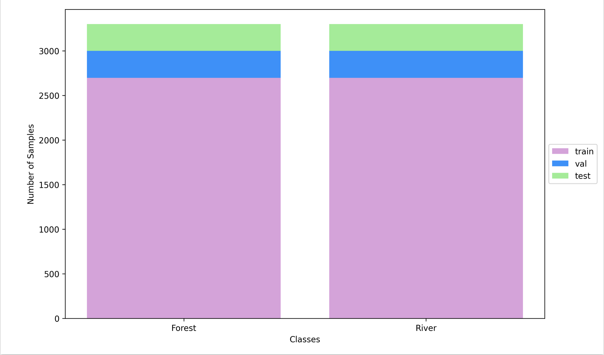

## Introduction

The task of this assignment was to build a classification model to distinguish between
River and Forest images. The purpose of this ReadMe file is to discuss the design
decisions made alongside some preliminary results.

## Data Splits

1. The files in the `RGB+IR Dataset/train/Forest` and `RGB+IR Dataset/train/River`
   each containing 2709 and 2199 images respectively were first loaded.
2. The images were divided by 216.
3. The desired number of examples per each class–i.e. River and Forest– was set to 3000.
4. consequently, 291 and 801 Forest and River images were generated by applying
   transformations (consecutive vertical and horizontal flips) to the original images
   and added to the original image sets.
5. The number of validation examples for each class was set to 301 images with respect
   to the number of images in `RGB+IR Dataset/val/Forest` and `RGB+IR Dataset/val/River`.
   The images in `RGB+IR Dataset/val/` were used as the held-out test set.
6. The final distribution of the labels for the train/val/test split is illustrated
   in Figure 1.

## Model Architecture

The best performing model can be found in Figure 2, which takes 4 channels as its input.
These four channels are simply the concatenation of Near-Infrared, R, G, and B channels.
After performing an ablation study on the architecture, it was realized that reducing the
dimensionality through convolution by using a kernel size of 5 and 3, as well as max-pooling
greatly improved the performance of the model. It should be noted that the activation
function between convolution layers is ReLU.

## Regularization

The regularization techniques implemented for this task are drop out and early stopping.
Applying a dropout rate of 0.5 after the first linear layer was found to significantly
improve the performance.

## Optimization

The loss function in this study was the binary cross-entropy with logits,
`BCEWithLogitsLoss()`, which was optimized by `AdamW` optimizer. The learning rate
was set to `0.01` which was reduced by a factor of `0.1` if validation loss did not
decrease after seven epochs. The minimum learning rate was also set to `0.0000000001`.

## Results

### Train Validation Curves

The curves below are indicative of the performance of the classification model with
respect to the loss function and accuracy on the train and validation datasets while
implementing early stopping.

Additionally, the loss and train curves below were plotted after training the model
for 200 epochs without early stopping.

### Loss and Accuracy

The table below also lists the loss and accuracy on the train, validation, and test
sets of the model that performed best on the validation set after applying early stopping,
which stopped the model training after 28 epochs.

| Dataset    |  Loss  | Accuracy |
| ---------- | :----: | :------: |
| Train      | 0.0157 |  99.59%  |
| Validation | 0.0130 |  99.67%  |
| Test       | 0.0181 |  98.67%  |

The following table also lists the loss and accuracy on the train, validation and test sets
of the model after training it for 200 epochs, without applying early stopping.

| Dataset    |  Loss  | Accuracy |
| ---------- | :----: | :------: |
| Train      | 0.0078 |  99.80%  |
| Validation | 0.0083 |  99.67%  |
| Test       | 0.0083 |  99.67%  |
